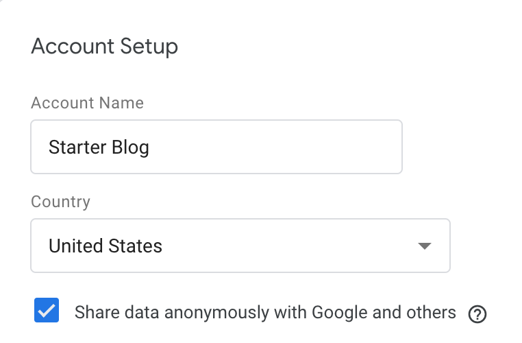
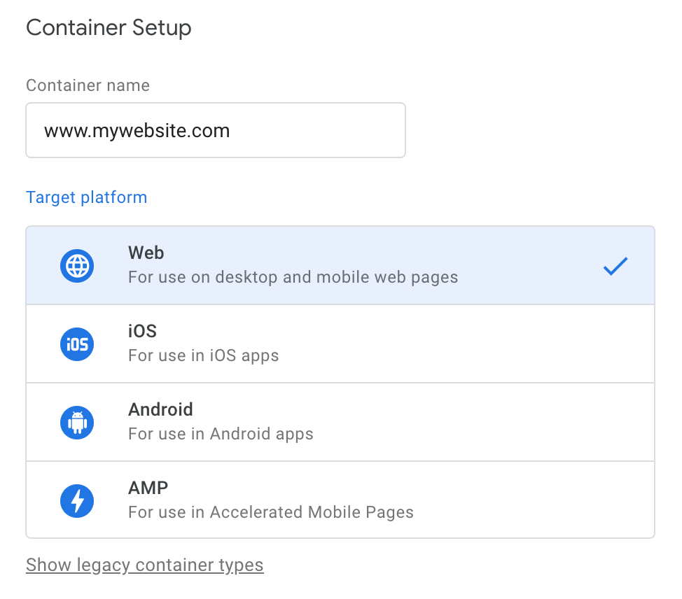
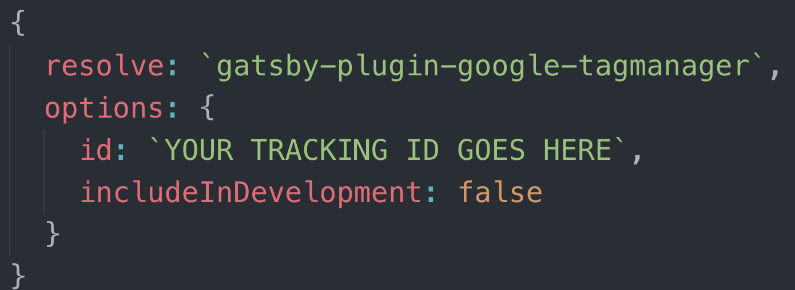

If you’ve been following my course 'Hands-On Web Development with React and GatsbyJS' then this is the post you’ll need to follow so you can set up your Tag Manager (TM) account and update your `gatsby-config` file. For those of you who aren’t following the course, this post will still be beneficial to you if you’ve never set up a Tag Manager account and are looking for some guidance. Just make sure you have already created a Google Analytics account and added the necessary tracking to your codebase.

 

###Account Creation
Let’s get into the nit-gritty and start by creating a Tag Manager account. Go to the TM home page. In the center of the screen you’ll a circle above the words `Click here to create an account` and a the button in the upper right that says `Create Account`.

After you click either of those, you’ll find yourself on the `admin/accounts/create` page and will need to fill in the following fields:

**Account Setup:**
* Account name: call this the name you’ll be using for your site or simply add a placeholder for now which you will be able to change later. I’m simply adding ‘Starter Blog’ for the time being.
- Country: this should automatically default to the country you are in but confirm and change if needed.
- Share data anonymously with Google and others: check this box if this is something you are okay with doing, otherwise leave unchecked.

**Container Setup:**
- Container name: Just like when we set up GA, I’m simply adding a placeholder domain until we have a real one in section when we deploy our site. I’ve used the same placeholder I used in GA: `www.mywebsite.com`.
- Target Platform: select the target platform you’ll be using. For the ‘Hands-On Web Development with React and GatsbyJS’ select `Web`.

Click the `Create` button in the bottom left.

Next you’ll see the Google Terms of Service. Change the language settings at the top of the screen if preferred and, after reading the terms of service, click the checkbox in the bottom left.

To proceed click `Yes` in the upper right hand corner of the screen.

Wait for Google to do its thing… save… load… Now you’ll see a modal. Anyone who is doing the Gatsby course with me can close out of this as we don’t need the blocks of code. If you’re coming from outside the course, you will probably need to add this to your codebase somewhere so go ahead and copy it before closing the modal, and add it where necessary.

Great, that’s account creation complete. Let’s move onto the next step where we’ll need to update our 'gatsby-config' file. Anyone who is not doing my course, feel free to jump ahead to the next section.

**Updating Our Config:**

This step will be easy and brief as there are only 2 things we need to do:

Copy the GTM ID from the bar along the top of your screen from the TM dashboard.

Go to your 'gatsby-config' file, scroll down to where we added the `gatsby-plugin-googletagmanager` and paste that ID into the `id` field.

